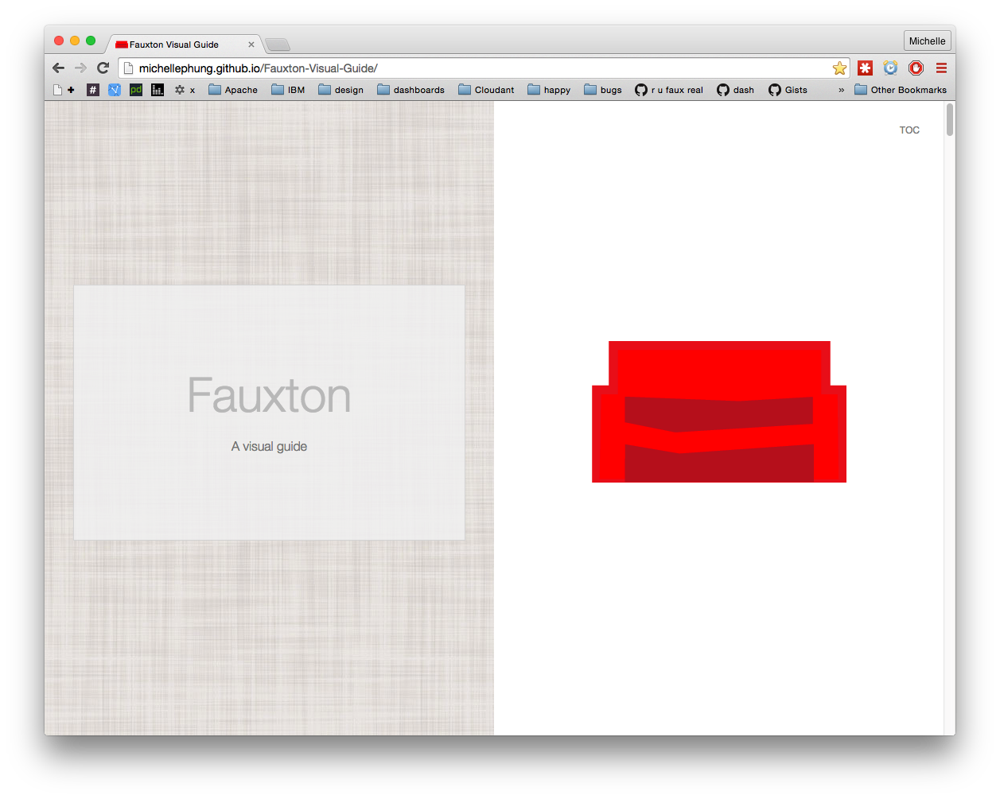

# Fauxton-Visual-Guide  
This is a Visual Guide to the [CouchDB Fauxton Project](https://github.com/apache/couchdb-fauxton)

[View on the Web](http://michellephung.github.io/Fauxton-Visual-Guide/)

Compiled using [Harp](http://harpjs.com/)

# More Guides
CouchDB [The Definitive Guide](http://guide.couchdb.org/)